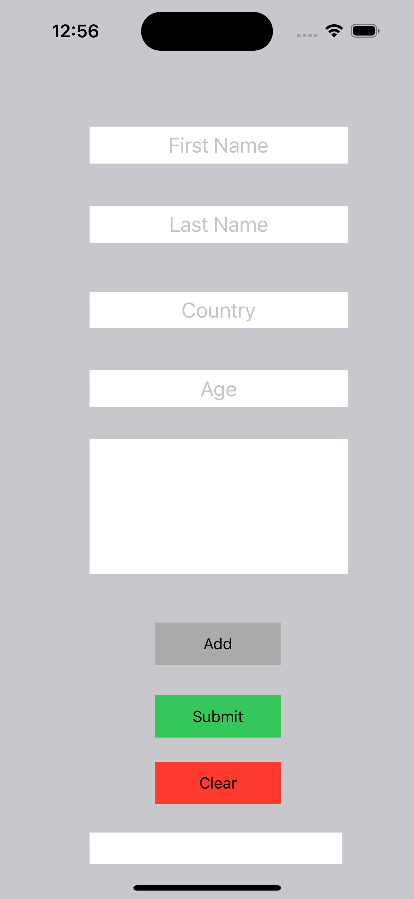
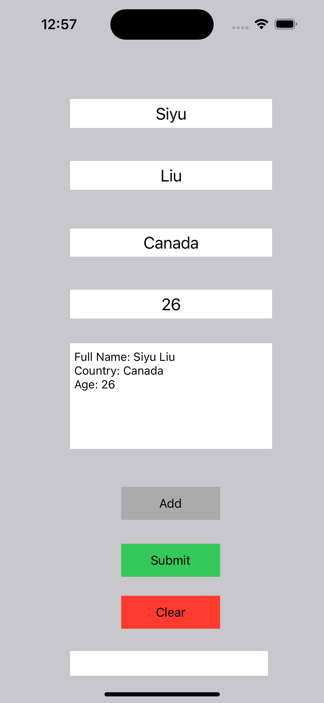
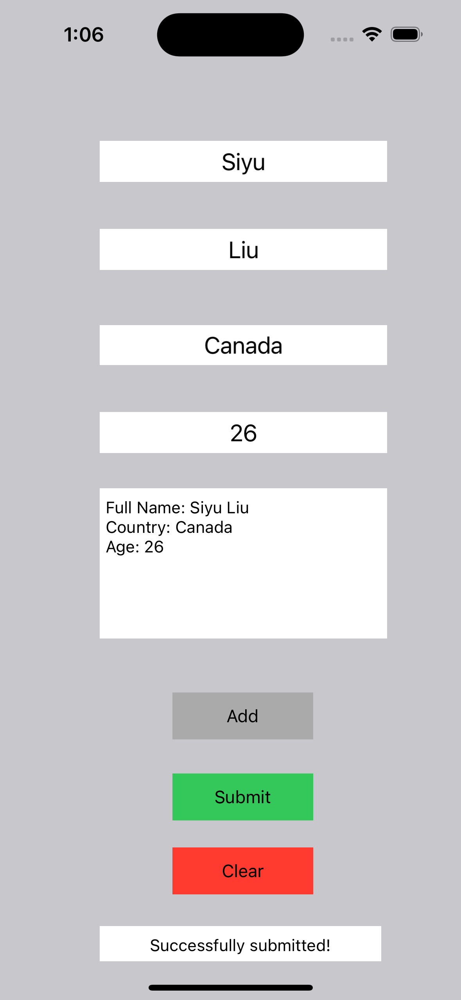

# PROG8470-IOS-Lab3-Form-Submission

Lab3 SPA project of PROG8470 IOS development of Conestoga College, it's a from for user to submit, the usage of this app is as follows.

## Initial State

## Input information and click 'add' button

The fifth textfield will display the current user's information.

## Click 'Submit' button

The textfield will display "successfully submitted".

## Clear all the textfield

click the 'Clear' button, all the text field will be cleared to empty state.

